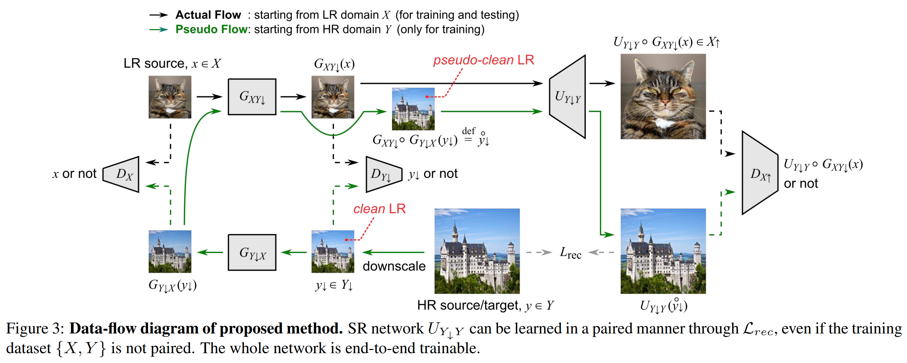

# Introduction



Please download the dataset from [here](https://github.com/jingyang2017/Face-and-Image-super-resolution). Then store High-resolution dataset into /../HR, and /../LR, respectively.

# Usage

First, configure the yaml file which is located at `configs/faces.yaml`. Set the root folder of face dataset to `DATA.FOLDER`.

To train:
python3 train.py configs/faces.yaml
```
CUDA_VISIBLE_DEVICES=2,3 python train.py configs/faces.yaml --port 12121
```

The `--port` option is only required for multi-gpu training.
You can use a number between 49152 and 65535 for the port number. 

# Reproducibility

TBA

# Reference

Maeda, Shunta. "Unpaired Image Super-Resolution using Pseudo-Supervision." Proceedings of the IEEE/CVF Conference on Computer Vision and Pattern Recognition. 2020.
